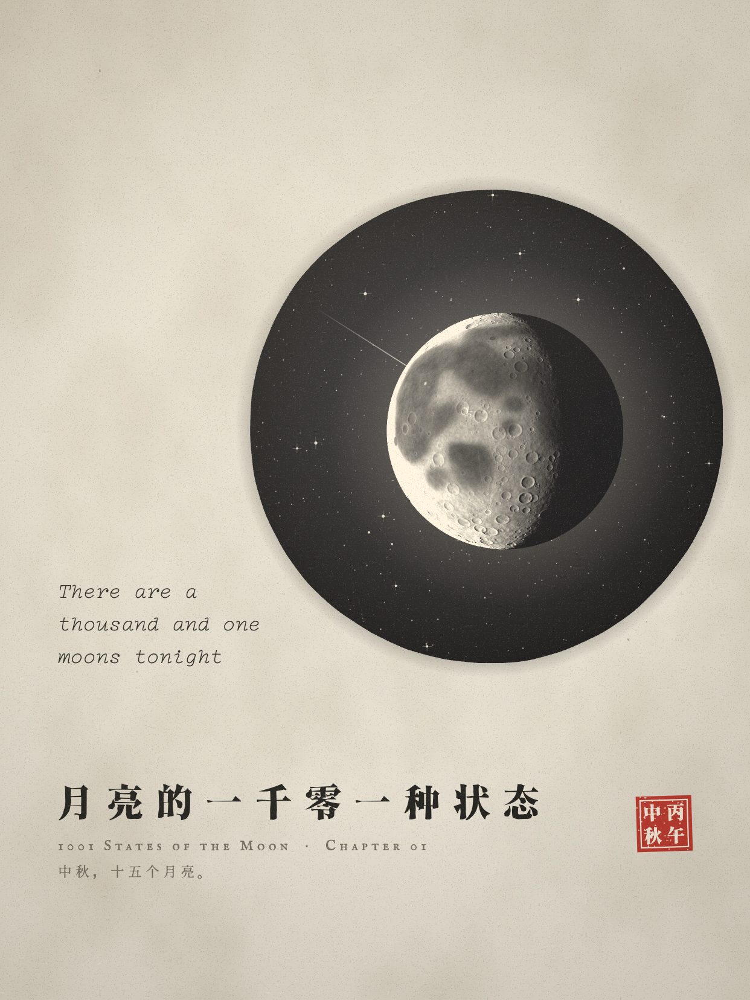

# 1001 States of the Moon · 月亮的一千零一种状态

> 今晚有一千零一种月亮。

第一辑 **中秋十五个月亮**（丙午年八月十五 · 2026.09.25）。线上：https://1001moons.vercel.app

开场是一轮月亮的特写，镜头一路往后拉，才发现它只是 *There are a thousand and one moons tonight* 末尾的那个句号，句号里装着一整片夜空。

然后，这个句号从句子里跳出来，变大，发现自己是空的。它想成为月亮。接下来的十五种状态，是它的十五次尝试，每一种的结局都是下一种的材料。最后它穿过一扇月洞门，成了今晚的月亮，又回到 *To be continued* 的末尾，做回一个句号。

| # | 状态 | 材料 | 怎么接到下一种 |
|---|------|------|----------------|
| 000 | 序 Prologue | 夜 | 从月亮特写拉远到一个句号 |
| 001 | 圆 Circle | 墨 | 句号跳出句子，长大，变成空心的圆 |
| 002 | 越来越少 Less & Less | 几何 | 顶点从 64 个减到 3 个，下一帧突然变成真实的月亮 |
| 003 | 月相 Phase | 光 | 一个月压缩成四秒 |
| 004 | 一口 Bite | 食欲 | 被咬出来的形状对应农历十七、二十、廿三…… |
| 005 | 尘 Dust | 月壤 | 碎屑散开，又被引力召回 |
| 006 | 沙 Sand | 重力 | 落成沙丘，化成一道银线 |
| 007 | 涟漪 Ripple | 水 | 水滴往天上流，溅出 36 圈波纹 |
| 008 | 拆线 Unravel | 线 | 波纹其实是一根线，被一拉到底 |
| 009 | 乱画 Scribble | 混沌 | 乱到某一瞬恰好是圆，最后写成「明」字 |
| 010 | 诗 Poem | 诗 | 苏轼《水调歌头》竖排，重新排成月亮；「月有阴晴圆缺」被标红 |
| 011 | 分辨率 Resolution | 像素 | 从 4K 一路降到 1 个像素 |
| 012 | 加载中 Loading | 等待 | 永远卡在 99% |
| 013 | 负形 Negative | 无 | 进度条碎成星星，星轨绕着一个空的圆 |
| 014 | 冒充者 Impostors | 物 | 铜钱、纽扣、唱片、瞳孔……最后一个是月洞门，镜头穿过门 |
| 015 | 月亮 Moon | 月 | 15 / 15 翻成 15 / 1001；月亮成为 *To be continued* 的句号，再飞回天上：中秋快乐 |

- 单文件 `index.html`，Canvas 2D，无构建步骤
- 24 fps 运动 + 12 fps 手作抖动与纸纹
- 原创配乐：D 大调 3/4 拍的小圆舞曲（120 BPM），同一个 16 小节主题贯穿全片，乐器跟着故事换——音乐盒（序）→ 钢琴圆舞曲（第一幕 成为）→ 竖琴与长笛（第三幕 寻找）→ 古筝（诗）→ 8-bit（屏幕）→ 卡在 99% 时唱片跳针 → 弦乐（第四幕 回家），全部用 Web Audio 实时合成，和画面同一个时钟
- 音效同样实时合成（打字、咬、沙、水滴、拨弦、磬、印章），`M` 键开关
- 复古胶片质感：厚纸斑驳、暖色主光、放映机闪烁、灰尘与划痕、磁带走音与黑胶底噪、纸上物体的柔和投影
- 四幕结构：成为 / 失去 / 寻找 / 回家；旁白逐字浮现，状态名换段时上浮淡出
- 结尾：月亮做回 *To be continued* 的句号，然后飞回天上——中秋快乐
- 字体（全部 SIL OFL，按片中用字子集化并改名，见 `fonts/LICENSES.md`）：
  - 香萃刻宋：标题、诗、印章、中秋快乐
  - 源云明体：旁白
  - IM FELL English SC：标签与状态名
  - Compagnon：开场句子、To be continued、时间码
- 月面程序生成：月海按真实月面经纬度布置，第谷辐射纹，Lommel–Seeliger 光照
- 封面（3:4，1242×1656）：`cover-xhs.png`，在线打开 `/?cover` 可重新生成
- Film / Index 两种模式；空格播放暂停，← → 切换，I 图鉴；`#10` 直接跳到第 10 种

15 / 1001 — TO BE CONTINUED.
